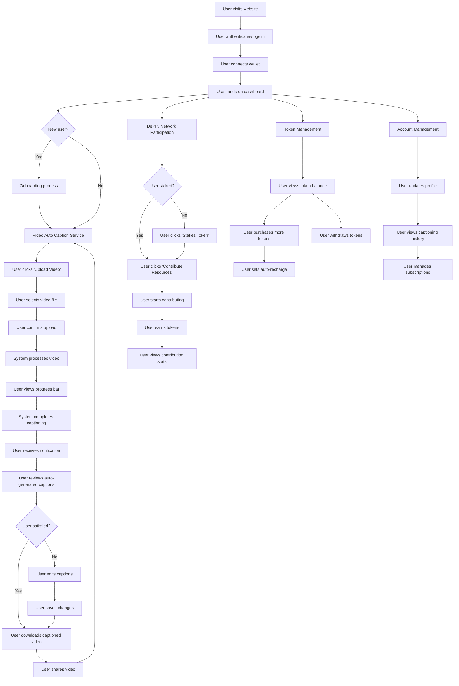

Here's a README file for your project based on the flow diagram you provided:

---

[Demo](https://vimeo.com/1007550172?share=copy)

# Project Name: Video Auto Caption Service with DePIN Network Participation

## Overview

This project provides a comprehensive platform for users to auto-generate captions for their videos and participate in a decentralized physical infrastructure network (DePIN) to earn tokens. The application offers seamless wallet integration, token management, and account management, making it easy for users to upload, process, and share videos with captions, as well as contribute resources to the network.

## Table of Contents

- [Features](#features)
- [Flow Diagram](#flow-diagram)
- [Sponsors Used](#Sponsors-used)
- [Blockchains Used](#Blockchains-used)
- [Installation](#installation)
- [Usage](#usage)


## Features

### Video Auto Caption Service

- **User Authentication**: Secure login and wallet connection.
- **Onboarding**: Guided onboarding process for new users.
- **Video Upload**: Users can upload videos to generate captions automatically.
- **Progress Tracking**: Real-time progress bar during the captioning process.
- **Caption Review**: Users can review and edit auto-generated captions.
- **Download and Share**: Download captioned videos and share them easily.

### DePIN Network Participation

- **Staking and Contribution**: Stake tokens and contribute resources to earn tokens.
- **Earnings Dashboard**: Track earnings and contribution statistics.

### Token Management

- **Token Balance**: View and manage token balances.
- **Purchases and Withdrawals**: Purchase more tokens, set auto-recharge, and withdraw tokens.

### Account Management

- **Profile Updates**: Update personal information and manage profile settings.


## Flow Diagram



## Sponsors Used

- **Web3Auth**: Used Web3auth as primary mode of authentication
- **Chainlink**: Used Chainlink's VRF to randomly select nodes
- **XMTP**: Using XMTP suscriber sdk for notifications
- **Sign Protocol**: Used sign protocol to generate attestations for the captioned video

## Blockchains Used
- **Ethereum Sepolia Testnet**
- **Rootstock Testnet**
- **Hedera Testnet**
- **Morph Testnet**
- **Kinto Holesky**

## Installation

1. Clone the repository:
   ```bash
   git clone https://github.com/your-repo/project-name.git
   ```
2. Install dependencies:
   ```bash
   cd project-name
   npm install
   ```
3. Set up environment variables:
   - Create a `.env` file in the root directory.
   - Add the necessary environment variables as per `.env.example`.

4. Start the development server:
   ```bash
   npm run dev
   ```

## Usage

1. Visit the website and log in using your credentials.
2. Connect your wallet to access the dashboard.
3. For new users, complete the onboarding process.
4. Upload a video to auto-generate captions, review, and edit as needed.
5. Participate in the DePIN network by staking tokens and contributing resources.
6. Manage tokens, account details, and view captioning history through the dashboard.

