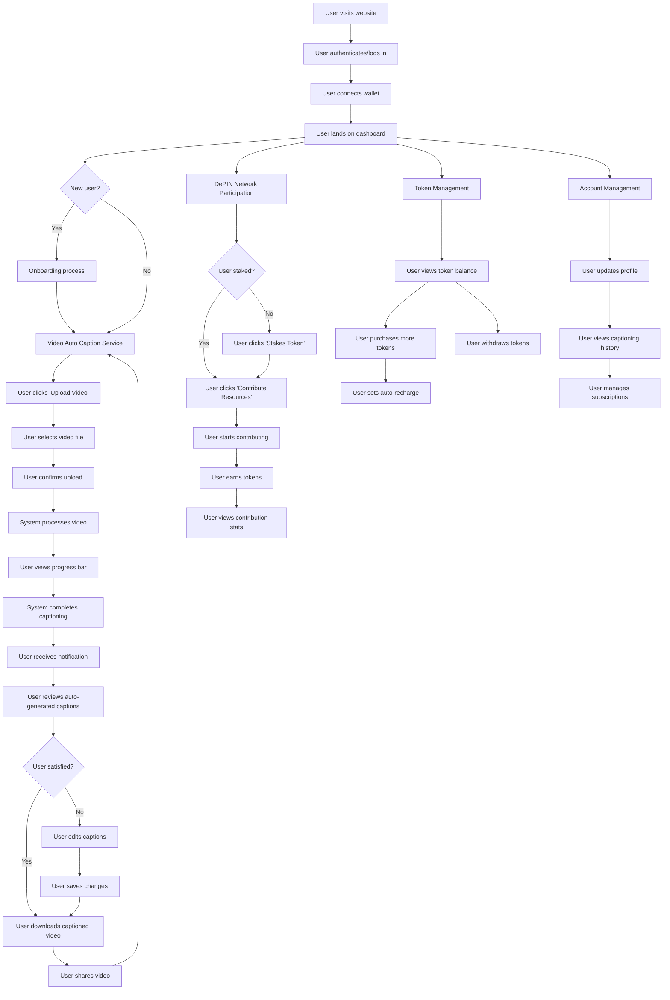
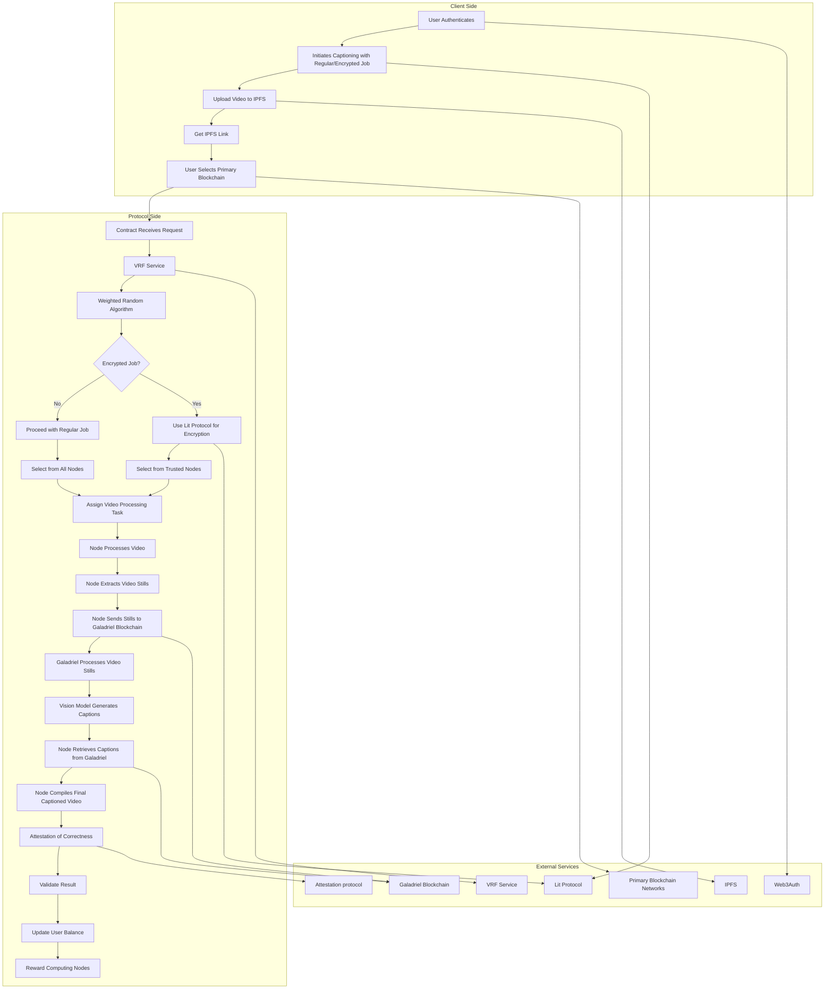

# Crystalrohr

Decentralized Video Captioning Protocol Flow

### User Journey Flow

This represents the general flow of what the user should interact with and how the user experience should feel

### Decentralized Video Captioning Flow

The system outlines a decentralized video captioning service using multiple blockchains, allowing secure processing and efficient caption generation through specialized node selection and blockchain interactions.

